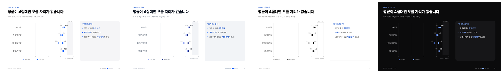

# pptx_maker

**한국어에 강한, 사람이 만든 것 같은 발표 자료(PPTX) 엔진** — 명세(JSON) 한 장 또는 파이썬 몇 줄로 덱을 만들고, 디자인을 자동으로 점검합니다.
AI(Claude Code·Claude Desktop·Codex·Gemini CLI·Cursor)에서 MCP 도구와 스킬로 바로 불러 쓸 수 있습니다.


## 무엇이 다른가

| | |
|---|---|
| **한국어 줄바꿈** | PowerPoint 는 한글 낱말을 가운데서 자릅니다. 엔진이 글꼴의 실제 글자 폭으로 어절 단위 줄을 미리 계산해 넣습니다(PowerPoint 실측과 줄 수 일치 — 69장·1,313개 글상자로 확인). |
| **장마다 다른 색** | 바탕은 중립색, 장(섹션)마다 내용에 맞는 포인트 색 하나(제도=남색, 설계=청록, 데이터=파랑, 고쳐 쓰기=진홍, 윤리=초록, 일정=호박). 작은 글자·흰 글자 대비는 자동 보정. |
| **AI 티 빼기** | 그라데이션·이모지·장식 띠·같은 카드 반복 없이, 선·여백·큰 숫자로 나누는 기본값. 같은 구성이 3장 이어지면 점검이 알려 줍니다. |
| **자동 점검** | 넘침·겹침·벗어남·작은 글자·대비(WCAG)·한 장의 색 수·반복·노트 누락. PowerPoint 가 있으면 PNG 미리 보기와 실제 줄 수 비교까지. |
| **빠르다** | PowerPoint 없이 순수 파이썬으로 .pptx 를 씁니다(69장 0.3~2초). 의존 패키지 없음(Pillow 는 선택). |
| **고칠 수 있다** | 그래프·도식은 모두 PowerPoint 도형이라 받은 사람이 그대로 고칠 수 있습니다. 모든 장에 발표자 노트. |

테마 네 가지 — 같은 장, 구성 방식이 다릅니다(editorial · civic · gallery · keynote):




## 시작하기

```bash
git clone https://github.com/ZZombie04/pptx_maker.git
cd pptx_maker
python -m pptx_maker doctor                    # 환경 점검(글꼴·PowerPoint·Pillow)
python -m pptx_maker example -o my_deck.json   # 예시 명세 + 예시 사진
python -m pptx_maker build my_deck.json --preview
```

설치 없이 저장소 폴더에서 바로 됩니다(다른 폴더에서 쓰려면 `PYTHONPATH` 에 저장소 폴더를 넣거나 `pip install .`).
Windows 는 `install.bat` 을 두 번 눌러도 됩니다(Pillow 확인 → AI 프로그램 연결).

### AI 에 연결(MCP + 스킬)

```bash
python -m pptx_maker setup          # 설치된 AI 프로그램을 찾아 MCP 등록 + Claude Code 스킬 설치(백업 후 수정)
python -m pptx_maker setup --only claude-code --yes
```

- MCP 도구: `pptx_start_here` `pptx_design_guide` `pptx_spec_guide` `pptx_python_guide` `pptx_themes` `pptx_suggest_palette` `pptx_example_spec` `pptx_build` `pptx_preview` `pptx_doctor`
- Claude Code 스킬: `~/.claude/skills/pptx-maker` — "발표 자료 만들어줘"라고 하면 스킬이 순서(내용 설계 → 색 → 명세 → 만들기·점검 → 미리 보기 확인)를 따릅니다.
- 직접 등록할 때(예: `.mcp.json`):
  ```json
  {"mcpServers": {"pptx_maker": {"command": "python", "args": ["-m", "pptx_maker.mcp_server"],
                                 "env": {"PYTHONPATH": "C:\\path\\to\\pptx_maker", "PYTHONIOENCODING": "utf-8"}}}}
  ```

## 명세(JSON) 한눈에

```json
{
  "theme": "editorial",
  "title": "연구학교 결과보고서, 증거로 완성하기",
  "images": ["photos"],
  "sections": [
    {"key": "p1", "label": "PART 1", "title": "제도를 읽다", "accent": "navy"},
    {"key": "p2", "label": "PART 2", "title": "증거를 설계하다", "accent": "blue"}
  ],
  "slides": [
    {"type": "cover", "title": "결과보고서,\n증거로\n**완성합니다**", "image": "desk_report", "notes": "…"},
    {"type": "agenda", "title": "오늘의 흐름", "notes": "…"},
    {"type": "section", "section": "p1", "sub": "제도가 지향하는 것", "image": "team_meeting", "notes": "…"},
    {"type": "stats", "section": "p1", "title": "보고서의 무게", "items": [["50쪽", "분량 상한"], ["50%", "평가 비중"]], "hi": [1], "notes": "…"},
    {"type": "compare", "section": "p2", "title": "같은 내용, 다른 제목", "before": "결과 현황", "after": "**전문성개발역량**이 가장 낮았습니다", "notes": "…"}
  ]
}
```

슬라이드 종류 20가지: `cover section statement bullets rows list2 cards table stats compare flow timeline quote checklist agenda workshop split two chart photo closing`
(그래프: `bars bar_pair dumbbell trend likert donut`). 전체 문법은 [SPEC.md](pptx_maker/data/SPEC.md), 디자인 원칙은 [DESIGN.md](pptx_maker/data/DESIGN.md), 자유 구성은 [PYTHON.md](pptx_maker/data/PYTHON.md).

## 파이썬으로 자유롭게

```python
from pptx_maker import Deck, P, para, rich, ML, CW
from pptx_maker.layouts import header, footer, flow_h

def make():
    d = Deck(theme="civic", title="사업 설명회", image_dirs=["photos"])
    d.section("p1", "PART 1", "추진 배경", accent="navy")
    s = d.slide("S01", section="p1", notes="말할 내용")
    header(s, "PART 1 · 배경", "세 단계로 1년을 운영합니다", "준비 → 실행 → 확산")
    flow_h(s, ML, 160, CW, [("준비", "3~4월 진단"), ("실행", "5~10월 운영"), ("확산", "11월 공유")], h=150, hi={1})
    footer(s)
    return d
```
`python -m pptx_maker build deck.py --preview`

## 명령

| 명령 | 하는 일 |
|---|---|
| `build 명세.json\|덱.py [-o 결과.pptx] [--preview] [--only 1,5] [--theme keynote]` | 만들기 + 점검(+미리 보기·모아 보기·실측) |
| `preview 파일.pptx [--only 1,2]` | 아무 .pptx 나 PNG·모아 보기로 |
| `themes` · `types` · `suggest "주제" --sections "장1\|장2"` | 테마·종류 목록, 색 추천 |
| `example -o x.json` | 모든 종류가 든 예시 명세(+사진) |
| `setup` · `mcp` · `doctor` | AI 연결 · MCP 서버 · 환경 점검 |

## 구조

```
pptx_maker/
  core.py      Deck·Slide 좌표 API, 색 토큰 해석, 자동 대비 보정
  writer.py    순수 파이썬 PPTX 쓰기(OOXML) — 어절 단위 줄바꿈을 <a:br/> 로
  textfit.py   한국어 줄 나눔·높이 계산(PowerPoint 줄 높이 실측 반영)
  fonts.py     글꼴 폭 읽기(TTF/OTF/TTC), Pretendard 측정표 내장
  theme.py     테마·포인트 색 가족·대비 계산·색 추천
  layouts.py   머리·꼬리·장 표지·표·흐름·숫자·비교·차례 등
  charts.py    도형으로 그리는 그래프
  spec.py      JSON 명세 → 덱(슬라이드 종류 20가지)
  qa.py        디자인 점검
  preview.py   PowerPoint/LibreOffice 로 PNG·모아 보기·실측
  mcp_server.py · cli.py · setup_cmd.py
  themes/*.json · data/(DESIGN·SPEC·PYTHON.md, 예시 명세, 측정표)
skill/pptx-maker/   Claude Code 스킬
examples/           showcase.json + 예시 사진
tests/run_tests.py  python tests/run_tests.py
```

## 메모

- 발표할 PC 에 [Pretendard](https://github.com/orioncactus/pretendard) 글꼴이 있어야 화면이 설계와 같습니다(엔진은 내장 측정표로 계산).
- 미리 보기는 PowerPoint(Windows) 또는 LibreOffice 가 필요합니다. 사용자가 열어 둔 PowerPoint 창은 건드리지 않고, 엔진이 띄운 것만 닫습니다.
- 예시 사진(examples/photos)은 생성 이미지로, 실존 인물·학교가 아닙니다.

MIT License
