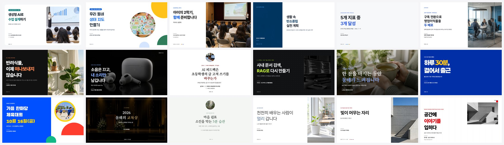
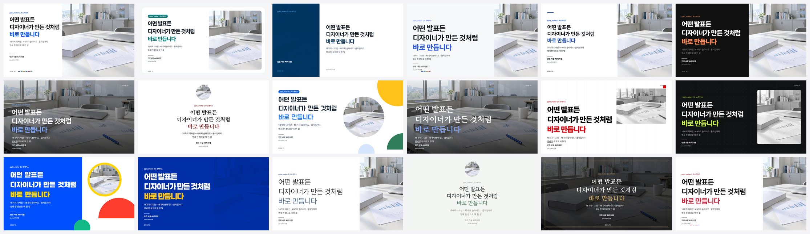

# pptx_maker

**한국어 발표 자료(PPTX)를 디자이너처럼.** 연수·수업·학부모 설명회·공공 보고·데이터 보고·전략·투자 피치·제품 발표·학회·개발자 발표·축제·시상식·상담·캠페인·전시까지, 상황과 의도에 맞는 디자인을 엔진이 고르고 점검합니다. Claude·GPT·Gemini·Grok, 어떤 AI 모델이 써도 같은 품질에 닿도록 만들었습니다.

[홍보 페이지](https://zzombie04.github.io/pptx_maker/) · [릴리스(스킬 zip·웹 AI zip·예시 덱 18개)](https://github.com/ZZombie04/pptx_maker/releases/latest)



## 무엇이 다른가

| | |
|---|---|
| **용도 24가지** | `training` `class_kids` `parents` `public` `data` `strategy` `pitch` `launch` `academic` `tech` `event` `ceremony` `counseling` … 용도를 고르면 테마·움직임·흐름·쓰는 법이 정해지고, `plan` 이 빈칸(TODO)만 남긴 명세를 줍니다. |
| **테마 18가지** | 색만이 아니라 글꼴 짝·표지와 장 표지 구성·머리말·꼬리말·카드와 표의 결까지 바뀝니다. 같은 명세도 `--theme` 하나로 전혀 다른 덱이 됩니다. |
| **슬라이드 48가지** | 표지·장 표지·한 문장부터 KPI·깔때기·피라미드·2×2·벤·조직도·요금표·팀·후기·코드·갤러리·시간표·로드맵·QR 까지. 그래프 16가지는 모두 고칠 수 있는 PowerPoint 도형. |
| **애니메이션** | Fade·Push·Wipe·Morph 전환과 항목별 나타나기(PowerPoint 기본 효과). 덱 전체를 `motion` 한 단어(none·subtle·build·dynamic·morph)로. PDF·MP4 내보내기. |
| **한국어 줄바꿈** | PowerPoint 는 한글 낱말을 가운데서 자릅니다. 엔진이 글꼴마다 실측한 폭으로 어절 단위 줄을 미리 나눕니다(PowerPoint 실측과 줄 수 일치). |
| **장마다 맞는 색** | 바탕은 중립색, 장(섹션)마다 내용에 맞는 포인트 색 하나 — 장 제목의 뜻을 읽어 엔진이 고릅니다. 브랜드 색은 `"#RRGGBB"` 하나로 가족 색을 만듭니다. 대비(WCAG)는 자동 보정. |
| **글꼴 22가지** | Pretendard·프리젠테이션·SUIT·Wanted Sans·IBM Plex Sans KR·페이퍼로지·나눔명조·고운바탕·검은고딕·주아… 공개 저장소에서 자동으로 받아 측정하고, 설치·발표 PC 용 꾸러미까지. |
| **자동 점검·채점** | 넘침·겹침·벗어남·대비·한 장의 색 수·반복·빈칸·노트 누락 + 100점 채점(구성·다양성·글·디자인·전달). PowerPoint 가 있으면 PNG 미리 보기와 실제 줄 수 비교. |
| **아이콘·QR** | 선 아이콘 2,000여 개(한국어 낱말 430개로 찾기)와 QR 코드를 도형으로 그립니다. 이모지는 쓰지 않습니다. |
| **가볍다** | 순수 파이썬, 설치할 패키지 0개(Pillow 는 선택). PowerPoint 없이 .pptx 를 1초 안팎에 씁니다. |

### 같은 내용, 열여덟 가지 얼굴



editorial · studio · civic · report · consulting · pitch / keynote · academic · classroom · magazine · swiss · tech / festival · poster · minimal · calm · noir · gallery

## 시작하기

```bash
git clone https://github.com/ZZombie04/pptx_maker.git
cd pptx_maker
python -m pptx_maker doctor                                  # 환경 점검(파이썬·글꼴·PowerPoint·Pillow)
python -m pptx_maker plan pitch --topic "식물 관리 앱" -o spec.json   # 용도별 뼈대
python -m pptx_maker build spec.json --preview               # 만들기 + 점검 + 채점 + 미리 보기
```

설치 없이 저장소 폴더에서 바로 됩니다(다른 폴더에서 쓰려면 `pip install .` 또는 `PYTHONPATH`). Windows 는 `install.bat` 을 두 번 눌러도 됩니다.

### AI 에 연결(MCP 도구 + 스킬)

```bash
python -m pptx_maker setup --fonts      # 설치된 AI 프로그램을 찾아 MCP 등록 + 스킬 설치 + 글꼴 설치(설정은 백업 후 수정)
python -m pptx_maker setup --only claude-code,codex --yes
```

| AI 프로그램 | 연결 |
|---|---|
| Claude Code · Claude Desktop | MCP + 스킬(`~/.claude/skills/pptx-maker`) |
| Codex CLI · Grok CLI | MCP(`config.toml`) + 스킬(`~/.agents/skills`) |
| Gemini CLI · Antigravity | MCP + 스킬, 저장소의 `GEMINI.md` |
| Cursor · Kiro · Windsurf · VS Code(Copilot) | MCP, 저장소의 `AGENTS.md` · `.github/copilot-instructions.md` |
| ChatGPT · Claude.ai · Gemini(웹) | 릴리스의 `pptx_maker-web.zip` 을 올리고 `WEB_AI.md` 의 글을 붙여 넣기 · Claude.ai 스킬은 `pptx-maker-skill.zip` |

MCP 도구 16개: `pptx_start_here` `pptx_recipes` `pptx_plan` `pptx_spec_guide` `pptx_design_guide` `pptx_python_guide` `pptx_themes` `pptx_suggest_palette` `pptx_example_spec` `pptx_check` `pptx_build` `pptx_preview` `pptx_export` `pptx_icons` `pptx_fonts` `pptx_doctor`

### 어떤 모델이 써도 같은 품질인 이유

디자인 판단(테마·장 색·글꼴·대비·줄바꿈·움직임)은 엔진이 합니다. AI 가 할 일은 정해진 순서뿐입니다.

1. **용도 고르기** — `recipes`(모르면 `suggest "주제"`)
2. **뼈대 받기** — `plan` 이 흐름과 슬라이드 종류를 정한 명세(TODO)를 줍니다
3. **빈칸 채우기** — 결론형 제목, 근거 2~5개, 발표 노트. 틀린 칸 이름도 알아듣고 '혹시 이것?'으로 알려 줍니다(`check`)
4. **점검·채점** — 오류·경고 0, 90점 이상이 될 때까지(넘치면 엔진이 장을 자동으로 나누기도 합니다)
5. **눈으로 보기** — `--preview` 모아 보기 그림

## 명세(JSON) 한눈에

```json
{
  "intent": "training",
  "title": "생성형 AI로 수업 설계하기",
  "images": ["photos"],
  "sections": [
    {"key": "p1", "title": "AI에게 잘 묻기", "desc": "막연한 질문엔 막연한 수업안"},
    {"key": "p2", "title": "교사의 눈으로 고치기", "accent": "#0E7C7B"}
  ],
  "slides": [
    {"type": "cover", "title": "생성형 AI로\n**수업 설계**하기", "image": "teacher_workshop", "notes": "…"},
    {"type": "statement", "lines": ["AI가 써 준 수업안,", "**그대로** 쓰시겠습니까?"], "notes": "…"},
    {"type": "section", "section": "p1", "image": "mentoring", "notes": "…"},
    {"type": "compare", "section": "p1", "title": "학년·시간·학생을 넣으면 **답이 달라집니다**", "before": "광합성 수업 계획을 짜 줘", "after": "초등 6학년 40분 …", "notes": "…"},
    {"type": "kpi", "section": "p2", "title": "…", "items": [{"value": "82%", "label": "학생 수준 맞추기", "delta": "+12%p", "spark": [61, 70, 82]}], "notes": "…"},
    {"type": "closing", "title": "초안은 AI가,\n**판단은 교사가**", "qr": "https://example.com", "notes": "…"}
  ]
}
```

슬라이드 종류 48가지:
`cover section statement closing photo bullets rows cards list2 table stats compare flow timeline quote checklist agenda workshop split two chart bignum kpi matrix pyramid funnel cycle venn team pricing features code gallery logos steps schedule roadmap faq definition versus progress qr takeaways org testimonials text shot free`
그래프: `column line area bars pie donut waterfall slope scatter heatmap gauge ring dumbbell likert trend bar_pair`

전체 문법 [SPEC.md](pptx_maker/data/SPEC.md) · 디자인 원칙 [DESIGN.md](pptx_maker/data/DESIGN.md) · 파이썬 좌표 API [PYTHON.md](pptx_maker/data/PYTHON.md) · 예시 덱 18개 [examples/decks](examples/decks)

## 용도와 테마

| 용도 | 어울리는 테마 · 움직임 | 용도 | 어울리는 테마 · 움직임 |
|---|---|---|---|
| training 교사 연수·직무 연수 | studio · build | strategy 경영 전략·컨설팅 | consulting · subtle |
| lecture 강의·설명회 | editorial · subtle | pitch 투자 피치·창업 | pitch · dynamic |
| class_kids 초등 수업 | classroom · build | launch 제품 출시·키노트 | keynote · morph |
| class_teen 중등·고등 수업 | classroom · build | marketing 브랜드 이야기 | magazine · subtle |
| parents 학부모 설명회 | civic · subtle(글자 1.15배) | campaign 캠페인·선언 | poster · dynamic |
| public 공공 보고·정책 브리핑 | civic · subtle | academic 학회·논문 심사 | academic · none |
| report 결과·연구 보고 | editorial · subtle | tech 개발자·IT·AI 교육 | tech · dynamic |
| data 데이터·KPI 보고 | report · subtle | portfolio 포트폴리오 | swiss · dynamic |
| weekly 주간·월간 보고 | report · none | event 축제·체육대회 | festival · dynamic |
| workshop 워크숍·회의 | studio · build | ceremony 시상식·졸업식 | noir · subtle |
| recruit 기관 소개·채용 | keynote · dynamic | counseling 상담·마음 건강 | calm · subtle |
| talk 강연·인문 | minimal · subtle | exhibition 전시·문화 기획 | gallery · subtle |

## 명령

| 명령 | 하는 일 |
|---|---|
| `recipes` · `plan 용도 --topic --minutes --sections` | 용도 목록 · 용도별 뼈대 명세 |
| `check 명세.json` · `score 명세.json` | 명세 점검('혹시 이것?') · 100점 채점 |
| `build 명세.json\|덱.py [-o] [--preview] [--theme] [--motion] [--pdf] [--video] [--pack-fonts]` | 만들기 + 점검(+미리 보기·PDF·MP4·글꼴 꾸러미) |
| `preview 파일.pptx` · `export 파일.pptx --pdf --video` | 아무 .pptx 나 PNG·모아 보기 · PDF·MP4 |
| `themes` · `types` · `suggest "주제"` · `icons 검색어` | 테마·종류 목록, 테마·색 추천, 아이콘 찾기 |
| `fonts list\|install\|download` | 글꼴 받기·설치(사용자 범위) |
| `example --intent pitch -o x.json` | 예시 명세 |
| `setup` · `mcp` · `pack -o dist` · `doctor` | AI 연결 · MCP 서버 · 웹 AI 묶음 · 환경 점검 |

## 구조

```
pptx_maker/
  spec.py      명세 → 덱(슬라이드 48가지, 이름 바꿔 알아듣기·자동 나누기·장 색 고르기)
  recipes.py   용도 24가지와 뼈대(plan)
  layouts.py   머리·꼬리·표지 바탕·장 표지·한 문장·표·흐름 …    blocks.py  KPI·도식·사람·요금·코드·갤러리 …
  charts.py    그래프 16가지(도형)       motion.py  전환·애니메이션(p:timing)
  theme.py     테마·포인트 색 가족·대비   fonts.py · fontreg.py · fontembed.py  글꼴 측정·받기·설치·내장
  core.py      Deck·Slide 좌표 API       writer.py  순수 파이썬 OOXML 쓰기
  textfit.py   한국어 줄 나눔·높이       icons.py · qr.py  아이콘·QR
  qa.py        점검·채점                 preview.py · ps/  PowerPoint 미리 보기·실측·PDF·MP4
  mcp_server.py · cli.py · setup_cmd.py · pack.py
  themes/*.json(tools/gen_themes.py 로 생성) · data/(문서·측정표·아이콘·글꼴 목록)
skill/pptx-maker/   AI 스킬          examples/   전시 덱(showcase) + 용도별 예시 덱 18개 + 예시 사진
docs/               홍보 페이지      tests/run_tests.py
```

## 메모

- 발표할 PC 에 테마 글꼴이 있어야 화면이 설계와 같습니다. `python -m pptx_maker fonts install` 또는 `build --pack-fonts`(결과 옆 `fonts/` 꾸러미), 또는 `--pdf` 로 내보내세요.
- 미리 보기는 PowerPoint(Windows) 또는 LibreOffice 가 필요합니다. 사용자가 열어 둔 PowerPoint 창은 건드리지 않고, 엔진이 띄운 것만 닫습니다.
- 예시의 내용·숫자·사람·기관은 가상이고, 예시 사진(examples/photos)은 생성 이미지입니다.
- 아이콘은 [Lucide](https://lucide.dev)(ISC), 글꼴은 각 저작권자의 공개 라이선스(SIL OFL 등)를 따릅니다 — [THIRD_PARTY_NOTICES.md](THIRD_PARTY_NOTICES.md).

MIT License

---

만든 사람 **AI리치쌤** · [joo.is/AI리치쌤](https://joo.is/AI%EB%A6%AC%EC%B9%98%EC%8C%A4)
